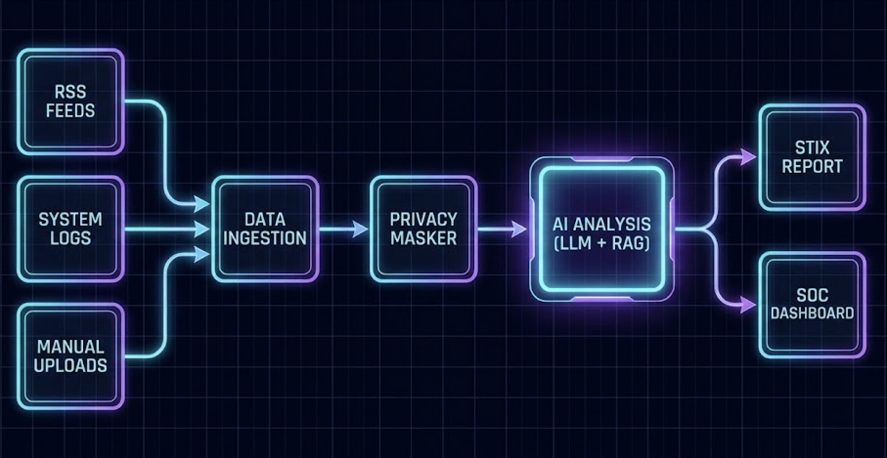
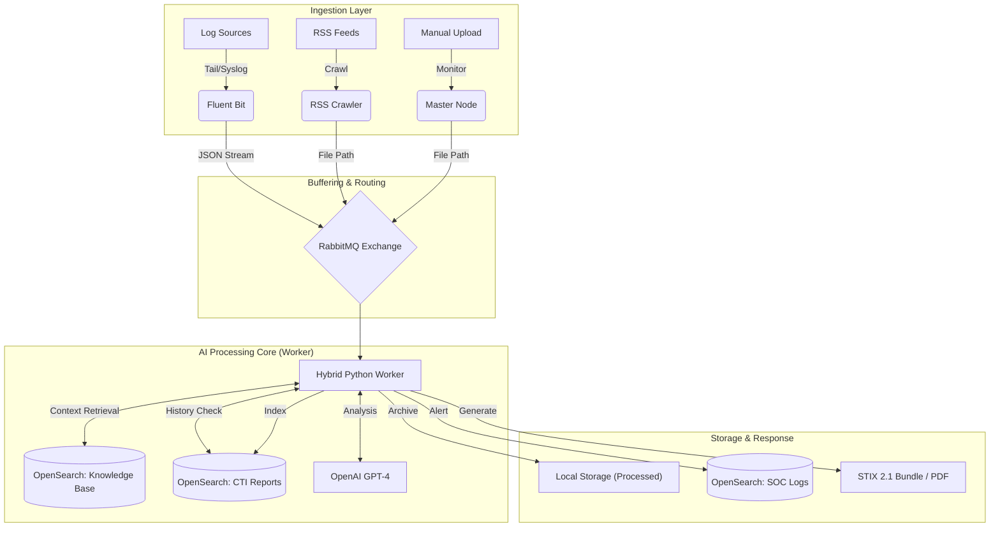

# 🛡️ NeoVigil: AI-Powered Hybrid SOC Pipeline

> **Next-Gen Cyber Threat Intelligence Platform with Hybrid Data Ingestion & Dual-Layer RAG**


---

**NeoVigil** is a production-ready Security Operations Center (SOC) pipeline that automates the lifecycle of threat detection. It uniquely combines **streaming log analysis** (via Fluent Bit) and **static intelligence processing** (via Automated Crawlers) into a unified, AI-driven engine.

Powered by **OpenAI (GPT-4)** and **OpenSearch**, it uses a **Dual-Index RAG** strategy to correlate real-time attacks with both external expert knowledge (MITRE/AIDEFEND) and internal historical incidents.

<div align="center">
  
  <br>
  <em>Figure: AI-Powered SOC Architecture with Triple Input Strategy.</em>
</div>

---

## 🏗️ System Architecture

The system utilizes a decoupled microservices architecture for maximum scalability and resilience:



---

## ✨ Key Features

### 1. Hybrid Data Ingestion (The "Double-Barreled" Engine)
* **⚡ Streaming Mode (Real-Time):**
    * Powered by **Fluent Bit**.
    * Ingests logs directly from servers (Syslog/Tail/TCP).
    * Performs pre-normalization (JSON Parsing) at the edge.
    * **Zero-Disk Footprint**: Logs flow directly from RAM to Queue to AI.
* **📂 File Mode (Batch/Static):**
    * Powered by **Master Node**.
    * Watches `data/input/` for manual dumps or RSS crawler outputs.
    * Handles heavy file reading and archiving logic.
    * **Data Sources**: Integrated feeds from **BleepingComputer**, **TheHackerNews**, and **OTX AlienVault** for comprehensive coverage.

### 2. Dual-Layer RAG (Retrieval-Augmented Generation)
Unlike standard RAG, this system queries two distinct indices to build context:
1.  **📚 Expert Knowledge Base**: Queries **MITRE ATT&CK** and **AI Defense Framework** to understand *what* the attack is and *how* to mitigate it.
2.  **🗄️ Internal History**: Queries **CTI Reports** to see if this specific threat has been seen in your organization before (Similarity Search).

### 3. Enterprise-Grade Resilience & Governance
* **Auto-Healing**: Workers utilize RabbitMQ acknowledgments (`ack`) to ensure no log is lost, even if the AI service crashes.
* **Auto-Maintenance**: Built-in schedulers perform daily "Disk Cleanup" (Retention Policy) and automated "Knowledge Base Updates" from GitHub.
* **Cost-Effective**: Implements a "Confidence Threshold" (<40%) to filter out noise before expensive PDF generation.

### 4. Automated Output
* **STIX 2.1 Bundles**: Generates industry-standard threat intelligence packages.
* **Executive PDF Reports**: Creates downloadable reports with Summary, IOCs, and AI-Suggested Mitigation Strategies.
* **PII Masking**: Automatically redacts IPs/Emails before sending data to LLMs.

### 5. Context-Aware Enrichment
* **GeoIP Integration**: Automatically resolves attacker locations (Latitude/Longitude/Country) for visual threat mapping.
* **Internal Asset Correlation (CMDB)**: Integrates with internal Asset Databases (CMDB) to identify target server roles, departments (e.g., IT, R&D), and criticality levels (CRITICAL/HIGH/LOW).
* **Dynamic Severity Scoring**: Automatically boosts alert priority when attacks target critical business infrastructure (e.g., Production Web Servers).

### 6. Advanced Optimizations (Performance & Resilience)
* **🚀 API Caching**: Reduces API calls to NVD/GeoIP by 90% using `lru_cache`, ensuring instant response for recurring threats.
* **🛡️ Absolute Whitelist**: Protects critical infrastructure (e.g., 8.8.8.8, Gateway IPs) from accidental AI blocking.
* **⚡ Keyword Triage**: A lightweight pre-filter drops 99% of benign logs before they reach the expensive LLM, drastically reducing costs.
* **📥 Dead-Letter Queue (DLQ)**: Failed tasks are auto-saved to `data/failed_tasks/` instead of being lost, ensuring 100% data reliability.
* **🧠 Human Feedback Loop**: AI learns from your feedback! When you "Reject" a report with a reason, the system memorizes it to avoid repeating the same mistake.

### 7. Intelligent Remediation Engine 🛡️
* **Attack Prioritization**: Automatically prioritizes alerts based on CVE severity or Attack Type (e.g., SQL Injection, XSS).
* **CVE-First Strategy**: If a CVE is detected, the engine immediately fetches relevant playbooks and patches.
* **Interactive Playbooks**: Dynamic Mermaid diagrams guide analysts through step-by-step mitigation.
* **Split-View Dashboard**: "Enriched Alerts Dashboard" provides a side-by-side view of active threats and their corresponding remediation plans.

### 8. Real-Time System Monitoring 📊
* **Resource Tracking**: Live CPU and Memory usage displayed directly in the dashboard sidebar using `psutil`.
* **Process Health**: Monitors critical processes to ensure stability.

### 9. Proactive Defense Controls & Compliance Framework 🏢🔒
Newly implemented features for production environments (ISO 27001 / SOC 2 Ready):

* **🚧 SOAR Guardrails**: 
    * **Critical Asset Protection**: Prevents automated blocking of internal subnets (`10.0.0.0/8`, `192.168.0.0/16`).
    * **Human-in-the-Loop**: High-risk internal alerts are automatically downgraded to "Pending Manual Approval".
* **📜 Audit Trail & Rollback**:
    * **Immutable Logging**: All analyst actions (Approve/Reject/Rollback) are logged to a tamper-proof OpenSearch index (`soc-audit-logs`).
    * **One-Click Rollback**: Instantly revert accidental IP blocks via the UI, recovering service availability in seconds.
* **🛡️ Privacy Shield (Local LLM Enforcement)**:
    * **Strict Mode**: Enforces `USE_LOCAL_LLM=true` to prevent sensitive data from leaving the premise.
    * **Cloud Block**: Automatically detects and blocks any fallback attempts to OpenAI/Azure if the local model fails.
    * **DLQ Routing**: Failed tasks are routed to a specialized Dead Letter Queue (`data/failed_tasks/privacy_blocked`) for forensic review.
* **🏗️ High Availability (HA)**:
    * **Resilient Architecture**: Worker nodes automatically recover from RabbitMQ broker outages (verified via Chaos Engineering).
    * **Scalability**: Docker Compose configuration supports horizontal scaling of worker nodes.

### 10. Enterprise DevOps & Multi-Tenancy (New) 🚀
* **🏢 Multi-Tenancy Support**:
    * **Data Isolation**: All OpenSearch indices (`security-logs-knn`, `cti-reports`) are partitioned by `tenant_id`.
    * **Tenant Views**: Dashboard supports filtering views by specific tenants (e.g., `tenant_alpha`).
* **🔄 CI/CD Pipeline (GitHub Actions)**:
    * **Automated Testing**: On every push, the system runs Unit, Smoke, and E2E tests.
    * **Staging Environment**: Uses `docker-compose.staging.yml` with a **Mock LLM** to simulate AI responses without API costs.
    * **Quality Gates**: Enforces `flake8` syntax checks and reachability tests before merge.
* **🛠️ Standardized Engineering**:
    * **Makefile**: Unified commands (`make unit`, `make e2e`) for local and CI execution.
    * **Type Safety & Linting**: Codebase standardized for Python 3.9+ type hinting.


| File Prefix | Source Type | Processing Mode | PDF Report | Primary Purpose |
| :--- | :--- | :--- | :--- | :--- |
| **`RSS_`** | Intelligence Feed | **Silent Ingestion** | JSON Only | Silently populates the knowledge base without generating noise. |
| **`LOG_`** | Threat Detection | **Correlation** | **Conditional** | Generates a PDF alert **ONLY** when logs match known threats. |
| **`Manual`** | Deep Analysis | **Full Investigation** | Always | Provides comprehensive analysis and archiving for specific cases. |

### 📊 Visualization & Storage
- **OpenSearch Integration**: Real-time indexing of all intelligence for lightning-fast searching and TTP mapping.
- **Dashboards**: Visualize attack trends, top threat actors, and active alerts via OpenSearch Dashboards.
- **Automated Reporting**: Generates executive-ready PDF reports summarizing IOCs, TTPs, and confidence scores.

---

## 🚀 Installation

### 1. Prerequisites

Before deploying the CTI Pipeline, ensure your host machine meets the following requirements to handle the AI processing and database workloads.

#### 🖥️ Hardware Requirements

| Component | Minimum | Recommended | Note |
| :--- | :--- | :--- | :--- |
| **OS** | Linux/macOS/Windows | Linux (Ubuntu 22.04+) | Optimized for Docker containerization. |
| **RAM** | **16 GB** | **32 GB** | OpenSearch and AI Workers are memory-intensive. **8GB is NOT sufficient.** |
| **CPU** | 4 Cores | 8 Cores | Multi-core CPU helps with parallel processing of Workers. |
| **Disk** | 20 GB Free | 50 GB Free | For storing Docker images and OpenSearch indices. |


#### 🛠️ Software Requirements

* **Docker Engine**: v24.0+
* **Docker Compose**: v2.20+
* **Python**: 3.9+ (For local development scripts)

---

#### ⚠️ Performance Note regarding Memory
The default configuration spawns **3 Worker containers**. If you are running on a machine with limited memory (< 16GB), please reduce the worker count in `docker-compose.yml` or run:

```bash
docker compose up -d --scale cti-pipeline-worker=1
```

### 2. Configuration
Clone the repository and set up your environment variables.

```bash
# Clone the repository
git clone https://github.com/uuluul/AI-powered-autonomous-SOC.git
cd ai-powered-autonomous-soc

# Create environment file
cp .env.example .env
```
Edit the .env file to configure your LLM provider. The system supports both Standard OpenAI and Azure OpenAI.

#### Option A: Standard OpenAI
```bash
OPENAI_API_KEY=sk-proj-xxxxxxxxxxxxxxxxxxxxxxx
OPENAI_MODEL=gpt-4o
```
#### Option B: Azure OpenAI
```bash
AZURE_OPENAI_API_KEY=your_azure_key
AZURE_OPENAI_ENDPOINT=(https://your-resource.openai.azure.com/)
AZURE_OPENAI_CHAT_DEPLOYMENT=gpt-4o
AZURE_OPENAI_EMBEDDING_DEPLOYMENT=text-embedding-3-small
AZURE_OPENAI_API_VERSION=2024-02-15-preview
```
### 3. Launch System
Start all services (Pipeline, Hunter, OpenSearch, Fluent Bit, Dashboards) with a single command:
```bash
docker compose up -d --build
```

### 4. Initialize Knowledge Base (First Time Only)
You must populate the RAG database with MITRE ATT&CK and AIDEFEND data for the AI analysis to work correctly.
```bash
docker compose exec cti-pipeline-master python /app/src/setup_knowledge_base.py
```
Wait for the message:  MITRE Import Completed/AIDEFEND Import Completed

## 📖 Usage Workflow

### Step 1: Automated Collection
The **RSS Crawler** runs in the background, fetching the latest cybersecurity news. You can also manually drop files into `data/input/`.

**To force a crawl immediately (for testing):**
```bash
docker compose exec rss-crawler python src/rss_crawler.py
```
### Step 2: CTI Review & Approval
Access the **Analyst Workbench** to review AI findings.

1.  Open Browser: **[http://localhost:8501](http://localhost:8501)**
- **Login: Use default credentials admin / admin.**
2.  Navigate to **"🔍 CTI Report Review"** in the sidebar.
3.  Select a pending report.
4.  (Optional) Edit the JSON analysis if needed.
5.  Click **"✅ Approve & Generate PDF"**.
    * *System Action: Generates a PDF report, indexes the IOCs to OpenSearch, and updates the Knowledge Base.*

### Step 3: Threat Hunting (Automated & Simulation)
The **Threat Hunter** module runs in the background (24/7), continuously scanning your internal logs for IOCs found in approved reports.

* **Real-World Scenario**: No action needed. If a real attacker matches an IOC, an alert is generated automatically.
* **Simulation (For Demo)**: To force a detection event and visualize it on the map, use this command to inject a fake log entry that matches your approved report:

```bash
# Replace '1.2.3.4' with an IP from your report, and 'RSS_Report_Name.txt' with your filename
docker exec -it cti-ui python -c "
import os
from opensearchpy import OpenSearch
from datetime import datetime

client = OpenSearch(
    hosts=[{'host': os.getenv('OPENSEARCH_HOST', 'opensearch-node'), 'port': 9200}],
    http_compress=True, use_ssl=False, verify_certs=False, ssl_show_warn=False
)

doc = {
    'timestamp': datetime.now().isoformat(),
    'source_ip': '1.2.3.4',  # CHANGE THIS to match your CTI report
    'dest_ip': '192.168.1.100',
    'attack_type': 'CTI Match',
    'severity': 'Critical',
    'threat_matched': True,
    'filename': 'RSS_Report_Name.txt' # CHANGE THIS to match your report filename
}

try:
    client.index(index='security-logs-knn', body=doc, refresh=True)
    print('  Attack Simulated! Check the Dashboard.')
except Exception as e:
    print(f'  Error: {e}')
"
```

### Step 4: SOC Visualization & Remediation
Go to **"🚨 Enriched Alerts Dashboard"** in the UI.
* **Live Threat Map**: Displays real-time attacks with accurate geolocation (City/Country) and "missile" visualization targeting your assets.
* **Intelligent Remediation**: Click on an alert to see the "Remediation Playbook" panel on the right.
    * **Playbooks**: View step-by-step mitigation guides (e.g., Block IP, Patch CVE, Isolate Host) rendered as interactive diagrams.
    * **Actionable Insights**: Immediate context on the attack vector (SQLi, DDoS, Brute Force).
* **System Health**: Monitor CPU/RAM usage in real-time on the sidebar.

### Step 5: Knowledge Management
Go to **"📚 Knowledge Base"** to:
* Browse all historical intelligence reports.
* **Download PDF**: Click the download button to get the full executive report including Mitigation Strategies and MITRE TTPs.

## 🔧 Advanced Configuration

You can tweak the internal pipeline behavior by modifying src/run_pipeline.py. Note that these changes require a container restart.

| Variable | Default | Description |
| :--- | :--- | :--- |
| `RETENTION_DAYS` | `30` | Number of days to keep files in `processed/`. |
| `CONFIDENCE_THRESHOLD` | `80` | Minimum score to trigger a PDF/Blocking alert. |
| `RAG_TOP_K` | `3` | Number of similar past cases to retrieve. |
| `MAX_REPORTS_LIMIT` | `200` | Maximum number of reports to fetch for Knowledge Base. |


## 🛠️ Tech Stack

* **Language: Python 3.9**
* **AI/LLM: GPT-4o, LangChain (RAG Logic)**
* **Database: OpenSearch (Vector Search/Lucene), SQLite (Task Queue)**
* **Log Collection: Fluent Bit**
* **Data Standard: STIX 2.1 JSON**
* **Infrastructure: Docker & Docker Compose**
* **Frontend: Streamlit, PyDeck (3D Maps), Plotly, Mermaid.js**
* **Monitoring: psutil (System Resources)**

* **Testing: Pytest (Unit/Integration), Chaos Engineering (Resilience)**

## 🧪 Testing & Development
This repository includes a standardized testing framework using `pytest` and `Makefile`.

### 1. Run Tests
```bash
# Run all tests (Unit, Smoke, E2E)
make test

# Run specific suites
make unit    # Syntax & Logic checks
make smoke   # Container connectivity (RabbitMQ/OpenSearch)
make e2e     # Full Pipeline verification (Log -> AI -> DB)
```

### 2. Staging Environment
For integration testing without OpenAI costs, use the Staging environment which includes a **Mock LLM**.
```bash
docker compose -f docker-compose.staging.yml up -d --build
```
* **Mock LLM**: Simulates GPT-4 responses locally on port `8000`.
* **Lightweight**: Excludes UI and Visualization containers to save resources.

## 📜 License & Acknowledgments

This project is licensed under the MIT License.

### Framework Integration & Attributions

This project incorporates data and concepts from the following open-source frameworks:

* **STIX™ (Structured Threat Information Expression)**:
    * **Standard**: STIX 2.1 (OASIS Open Standard)
    * **Documentation**: [OASIS CTI Documentation](https://oasis-open.github.io/cti-documentation/)
    * *Adheres to international standards for representing and sharing cyber threat intelligence in a structured format.*

* **AIDEFEND (AI Defense Framework)**:
    * **Creator**: Edward Lee
    * **Source**: [edward-playground/aidefense-framework](https://github.com/edward-playground/aidefense-framework)
    * **License**: Creative Commons Attribution 4.0 International (CC BY 4.0).
    * *Utilize the AIDEFEND knowledge base to provide AI-specific defensive countermeasures in the RAG pipeline.*

* **MITRE ATT&CK®**:
    * **Source**: [The MITRE Corporation](https://attack.mitre.org/)
    * *Used for mapping adversary tactics and techniques.*

* **OASIS Open stix2-validator**:
    * **Source**: [oasis-open/cti-stix-validator](https://github.com/oasis-open/cti-stix-validator)
    * *Used for ensuring the integrity and compliance of generated JSON bundles with the STIX 2.1 specification.*