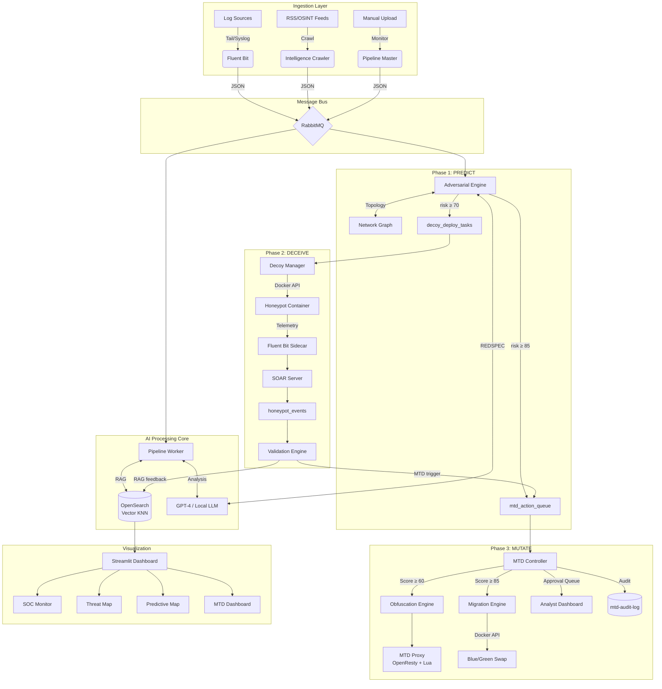

<div align="center">

# 🛡️ NeoVigil

### The Active Adversarial Architecture for Autonomous Cyber Defense

**Predict · Deceive · Mutate**

[]()
[]()
[]()
[]()
[]()
[]()

---

*NeoVigil is a next-generation, AI-powered Security Operations Center that transcends passive detection. It constructs an **Active Defense Triad** — predicting attack paths before they materialize, deploying self-evolving deception to capture attacker tradecraft, and dynamically mutating the live attack surface to invalidate all adversary reconnaissance in real-time.*

</div>

---

## 📋 Table of Contents

- [Executive Summary](#-executive-summary)
- [The Active Defense Triad](#-the-active-defense-triad)
  - [Phase 1 — Predict](#-phase-1--predict-topology-aware-attack-path-prediction)
  - [Phase 2 — Deceive](#-phase-2--deceive-self-evolving-dynamic-honeypots)
  - [Phase 3 — Mutate](#-phase-3--mutate-moving-target-defense)
- [System Architecture](#-system-architecture)
- [Core Platform Capabilities](#-core-platform-capabilities)
- [Quick Start](#-quick-start)
- [Usage & Operations](#-usage--operations)
- [The APT Kill Chain Demo](#-the-apt-kill-chain-demo)
- [Configuration Reference](#-configuration-reference)
- [Tech Stack](#-tech-stack)
- [Testing & CI/CD](#-testing--cicd)
- [License & Acknowledgments](#-license--acknowledgments)

---

## 🎯 Executive Summary

Traditional SOC platforms are **fundamentally reactive**. They wait for an attacker to breach the perimeter, then scramble to detect, triage, and contain. By the time an analyst reviews the alert, the adversary has already pivoted, exfiltrated, and covered their tracks.

**NeoVigil inverts this paradigm.**

Instead of waiting for the breach, NeoVigil builds an **Active Adversarial Architecture** that forces the attacker into a losing position at every stage of the kill chain:

| Traditional SOC | NeoVigil Active Defense |
|:---|:---|
| Detects attacks **after** they happen | **Predicts** the next 3 steps before they occur |
| Static, predictable infrastructure | **Mutates** the attack surface in real-time |
| Relies on known signatures | **Captures** novel zero-day tradecraft from live attackers |
| Manual triage, alert fatigue | **Autonomous** response with RBAC guardrails |
| Intelligence is external, stale | **Self-evolving** — every capture makes the system smarter |

The result is a **closed-loop defense system** where:
1. **Phase 1** predicts the attacker's next move,
2. **Phase 2** places a trap exactly where the attacker is going,
3. **Phase 2** captures the attacker's tools and feeds them back into Phase 1,
4. **Phase 3** mutates the real infrastructure so the attacker's reconnaissance becomes worthless.


---

## 🔺 The Active Defense Triad

<div align="center">
  
  <br>
  <em>NeoVigil's Active Adversarial Architecture: Predict → Deceive → Mutate</em>
</div>

---

### ⚡ Phase 1 — PREDICT: Topology-Aware Attack Path Prediction


Phase 1 transforms NeoVigil from a detection engine into a **prediction engine**. Using a Red Team LLM persona called **REDSPEC** (Red-team Speculative Prediction Engine for Cyber-attacks), the system analyzes every high-severity alert and predicts the attacker's next 3 kill chain steps.

#### How It Works

```
High-Severity Alert → RAG Context Retrieval → Network Topology Graph
        ↓                     ↓                        ↓
    REDSPEC LLM ← combines all three signals → Predicted Kill Chain
        ↓
   3-Step Attack Path with per-step confidence scores
        ↓
   Risk ≥ 70 → Deploy Honeypot (Phase 2)
   Risk ≥ 85 → Trigger MTD (Phase 3)
```

#### Key Capabilities

| Capability | Detail |
|:---|:---|
| **REDSPEC Persona** | GPT-4 as a Red Team operator predicting lateral movement, privilege escalation, and data exfiltration paths |
| **Topology-Aware** | Ingests network graph (subnets, ACLs, trust zones) so predictions follow real network paths |
| **CMDB-Enriched** | Correlates asset criticality (Critical/High/Medium/Low) to prioritize predictions |
| **RAG-Augmented** | Retrieves historical attack patterns from the vector knowledge base for grounded predictions |
| **Multi-Tenant** | Predictions are partitioned by `tenant_id` for full data isolation |
| **Zero-Log Prediction** | Novel capability: predicts attack paths even when no prior alerts exist for a new tenant |

#### Output: Predictive Threat Map

The Streamlit dashboard renders predictions as an interactive **🎯 Predictive Threat Map** showing:
- Source host (compromised)
- Predicted kill chain arrows with per-step confidence
- Destination hosts with criticality halos
- Risk score heat coloring

---

### 🍯 Phase 2 — DECEIVE: Self-Evolving Dynamic Honeypots


Phase 2 closes the loop. When Phase 1 predicts an attack path, Phase 2 automatically deploys a **honeypot on the predicted path** — a realistic decoy service that looks just like the real target but is an instrumented trap.

#### How It Works

```
Phase 1 Prediction (risk ≥ 70)
        ↓
   Decoy Manager → Selects template matching predicted service
        ↓
   Docker API → Deploys honeypot container on isolated network
        ↓
   Fluent Bit Sidecar → Streams all interaction telemetry
        ↓
   Validation Engine → Compares actual attacker behavior vs. prediction
        ↓
   RAG Feedback → Captured techniques indexed to knowledge base
        ↓
   Phase 1 retrieves captures for future predictions → SYSTEM GETS SMARTER
```

#### Key Capabilities

| Capability | Detail |
|:---|:---|
| **8 Service Templates** | SSH, SMB, RDP, HTTP, HTTPS, PostgreSQL, MySQL, LDAP — each with realistic banners and behaviors |
| **3 Fidelity Tiers** | LOW (banner-only), MEDIUM (partial protocol), HIGH (full service emulation) |
| **Tombstone TTL** | Honeypots auto-destroy after configurable TTL (default: 4h) to prevent sprawl |
| **Prediction Validation** | Compares predicted techniques against actual attacker TTPs — measures Phase 1 accuracy |
| **Zero-Day Detection** | Novel payloads (hash never seen before) are flagged for Tier 2+ analyst review |
| **RAG Feedback Loop** | Every capture is indexed back into `security-logs-knn`, making REDSPEC smarter |

#### The Self-Evolution Loop

```
Phase 1 predicts attack → Honeypot deployed on path
     ↑                           ↓
System gets smarter     Attacker hits honeypot
     ↑                           ↓
RAG indexes capture ← Validation Engine processes telemetry
```

This is not a static system. **Every attacker that touches NeoVigil makes it harder for the next one.**

---

### 🔄 Phase 3 — MUTATE: Moving Target Defense


Phase 3 is the final piece of the triad. When the MTD composite threat score reaches critical thresholds, NeoVigil **dynamically alters the live production infrastructure** — spoofing server fingerprints and performing zero-downtime container migrations — so that all attacker reconnaissance becomes instantly invalid.

#### How It Works

```
Trigger Sources:
  • Phase 1: prediction risk ≥ 85
  • Phase 2: validated honeypot capture
  • Scanner detection: repeated probes from same IP
  • Manual: analyst-initiated

        ↓ mtd_action_queue

   MTD Controller → Gathers multi-signal intelligence
        ↓
   Composite Score = 40% prediction risk
                   + 30% honeypot captures
                   + 20% scanner frequency
                   + 10% asset criticality
        ↓
   Score ≥ 60 → Obfuscation (auto-approved)
   Score ≥ 75 → Migration proposed (Tier2 approval)
   Score ≥ 85 → Migration executed (Tier2 approval)
```

#### Key Capabilities

| Capability | Detail |
|:---|:---|
| **Nginx/OpenResty Obfuscation** | Lua-powered per-IP header spoofing — scanners see Apache when you run Nginx, IIS when you run Node.js |
| **6 Spoof Profiles** | Apache/PHP, IIS/ASP.NET, LiteSpeed, CloudFlare, Caddy, Custom — randomly selected per scanner |
| **Blue/Green Migration** | 4-phase zero-downtime container migration: Clone → Start Green → Drain → Swap |
| **Rollback Snapshots** | Every migration is reversible within configurable TTL (default: 4h) |
| **Post-Migration Honeypot** | After migration, the old container is automatically converted into a honeypot |
| **RBAC Approval Gates** | Obfuscation: auto-approved. Migration: Tier2+ required. Emergency lockdown: Admin required |
| **Approval Timeout Escalation** | Unapproved actions escalate after 15min (configurable) |
| **Immutable Audit Trail** | Every action — propose, approve, reject, execute, rollback — logged to `mtd-audit-log` |

---

## 🏗️ System Architecture

NeoVigil is composed of **17 microservices** orchestrated via Docker Compose:



### Service Inventory

| # | Service | Purpose | Phase |
|:-:|:---|:---|:-:|
| 1 | `opensearch-node` | Vector search, KNN, telemetry indexing | Core |
| 2 | `opensearch-dashboards` | Data exploration & visualization | Core |
| 3 | `rabbitmq` | Message bus (9 queues) | Core |
| 4 | `fluent-bit` | Real-time log streaming | Core |
| 5 | `soar-server` | Alert relay & honeypot telemetry bridge | Core |
| 6 | `log-generator` | Simulated log source | Core |
| 7 | `setup-worker` | Index initialization | Core |
| 8 | `cti-pipeline-master` | File ingestion & scheduling | Core |
| 9 | `cti-pipeline-worker` | AI analysis (RAG + LLM) | Core |
| 10 | `threat-hunter` | Continuous IOC scanning | Core |
| 11 | `intelligence-crawler` | OSINT feed aggregation | Core |
| 12 | `cti-ui` | Streamlit SOC dashboard | Core |
| 13 | `prediction-engine` | REDSPEC attack path prediction | Phase 1 |
| 14 | `decoy-manager` | Honeypot lifecycle orchestration | Phase 2 |
| 15 | `validation-engine` | Prediction validation & RAG feedback | Phase 2 |
| 16 | `mtd-controller` | MTD scoring, RBAC, action dispatch | Phase 3 |
| 17 | `mtd-proxy` | OpenResty with Lua obfuscation | Phase 3 |

---

## 🛠️ Core Platform Capabilities

Beyond the Active Defense Triad, NeoVigil provides a full enterprise SOC platform:

- **Dual-Layer RAG** — Queries both the MITRE/AIDEFEND expert knowledge base and internal historical CTI reports for grounded AI analysis
- **STIX 2.1 Compliance** — Generates and validates industry-standard threat intelligence bundles
- **Executive PDF Reports** — Automated report generation with IOCs, TTPs, and AI-suggested mitigations
- **PII Masking** — Automatic redaction of IPs/emails before LLM processing
- **GeoIP Enrichment** — Real-time attacker geolocation for threat mapping
- **CMDB Integration** — Asset criticality scoring for dynamic alert prioritization
- **5-Level RBAC** — Viewer → Tier 1 → Tier 2 → Admin → System Owner (ISO 27001 / SOC 2 ready)
- **SOAR Guardrails** — Critical asset protection, human-in-the-loop for internal threats
- **Immutable Audit Trail** — All analyst actions logged to tamper-proof indices
- **Dead-Letter Queue** — Zero data loss; failed tasks preserved for forensic review
- **Multi-Tenancy** — Full data isolation via `tenant_id` partitioning across all indices
- **Privacy Shield** — Local LLM enforcement mode blocks cloud API fallback

---

## 🚀 Quick Start

### Prerequisites

| Component | Minimum | Recommended |
|:---|:---|:---|
| **OS** | Linux / macOS / Windows | Linux (Ubuntu 22.04+) |
| **RAM** | 16 GB | 32 GB |
| **CPU** | 4 Cores | 8 Cores |
| **Disk** | 20 GB free | 50 GB free |
| **Docker Engine** | v24.0+ | Latest |
| **Docker Compose** | v2.20+ | Latest |
| **Python** | 3.9+ | 3.10+ |

### 1. Clone & Configure

```bash
git clone https://github.com/uuluul/AI-powered-autonomous-SOC.git
cd AI-powered-autonomous-SOC

cp .env.example .env
```

Edit `.env` with your LLM provider credentials:

```bash
# Option A: Standard OpenAI
OPENAI_API_KEY=sk-proj-xxxxxxxxxxxxxxxxxxxxxxx
OPENAI_MODEL=gpt-4o

# Option B: Azure OpenAI
AZURE_OPENAI_API_KEY=your_azure_key
AZURE_OPENAI_ENDPOINT=https://your-resource.openai.azure.com/
AZURE_OPENAI_CHAT_DEPLOYMENT=gpt-4o
AZURE_OPENAI_EMBEDDING_DEPLOYMENT=text-embedding-3-small
AZURE_OPENAI_API_VERSION=2024-02-15-preview
```

### 2. Launch NeoVigil

```bash
docker compose up -d --build
```

This starts all 17 services. On machines with < 16 GB RAM:

```bash
docker compose up -d --build --scale cti-pipeline-worker=1
```

### 3. Initialize Knowledge Base (First Run Only)

```bash
docker compose exec cti-pipeline-master python /app/src/setup_knowledge_base.py
```

Wait for: `✅ MITRE Import Completed` / `✅ AIDEFEND Import Completed`

### 4. Verify Installation

Run the production validation suite to ensure all systems are operational:

```bash
./test_all.sh
```

### 5. Access the Dashboard

Open **[http://localhost:8501](http://localhost:8501)** and log in with `admin / admin`.

---

## 📖 Usage & Operations

### SOC Dashboard Pages

| Page | Description |
|:---|:---|
| 🚨 **Internal Threat Monitor** | Real-time SOC alerts with severity filtering |
| 📈 **Enriched Alerts Dashboard** | Threat map, geolocation, remediation playbooks |
| 🕸️ **Threat Graph** | Visual network topology with attack overlays |
| 📚 **Knowledge Base** | Historical CTI reports, PDF downloads |
| 🔍 **CTI Report Review** | AI analysis approval/rejection workflow |
| 📜 **Audit & Compliance** | Immutable action log (ISO 27001 / SOC 2) |
| 🎯 **Predictive Threat Map** | Phase 1 attack path predictions |
| 🛡️ **Moving Target Defense** | Phase 3 obfuscation rules, approvals, migrations, audit |

### Operational Workflows

**Automated Collection** — Intelligence crawlers continuously fetch from BleepingComputer, TheHackerNews, and OTX AlienVault.

**Threat Hunting** — The hunter module runs 24/7, scanning internal logs against approved IOCs. Matches generate automatic alerts.

**Predictive Defense** — High-severity alerts trigger REDSPEC predictions. Risk ≥ 70 deploys decoys. Risk ≥ 85 triggers MTD evaluation.

**MTD Approval** — Migration proposals appear in the 🛡️ MTD dashboard. Tier 2+ analysts approve or reject within the configurable timeout window (default: 15 min).

---

## 🎬 The APT Kill Chain Demo

NeoVigil ships with `simulate_apt_killchain.py` — a cinematic, color-coded terminal script that demonstrates the full Active Defense Triad in real-time.

```bash
# Ensure NeoVigil is running, then:
python simulate_apt_killchain.py
```

The script simulates a full APT kill chain:

1. **Phase 1 (Predict)** — Injects a Log4Shell initial access event → forces REDSPEC to predict the kill chain
2. **Phase 2 (Deceive)** — Simulates the attacker hitting the predicted honeypot → triggers validation & RAG feedback
3. **Phase 3 (Mutate)** — Floods scanner probes → pushes MTD score ≥ 85 → triggers obfuscation + migration proposal

---

## ⚙️ Configuration Reference

| Variable | Default | Description |
|:---|:---|:---|
| `RETENTION_DAYS` | `30` | Days to keep processed files |
| `CONFIDENCE_THRESHOLD` | `80` | Minimum score for PDF/blocking alert |
| `RAG_TOP_K` | `3` | Similar past cases to retrieve |
| `MAX_ACTIVE_DECOYS` | `10` | Maximum concurrent honeypots |
| `DECOY_TTL_HOURS` | `4` | Honeypot auto-destroy timer |
| `MTD_APPROVAL_TIMEOUT` | `15` | Minutes before unapproved actions escalate |
| `MTD_DRAIN_TIMEOUT` | `30` | Seconds to drain connections during migration |
| `MTD_ROLLBACK_HOURS` | `4` | Hours a migration remains rollback-eligible |

---

## 🛠️ Tech Stack

| Layer | Technology |
|:---|:---|
| **Language** | Python 3.10+ |
| **AI/LLM** | GPT-4o, LangChain (RAG), REDSPEC (adversarial persona) |
| **Search & Vector DB** | OpenSearch (KNN, Vector Search, Lucene) |
| **Message Bus** | RabbitMQ (9 queues, durable, DLQ) |
| **Log Ingestion** | Fluent Bit (streaming), RSS/OTX crawlers (batch) |
| **Deception** | Docker SDK (container orchestration), Fluent Bit sidecars |
| **MTD Proxy** | OpenResty (Nginx + Lua) |
| **Container Orchestration** | Docker & Docker Compose (17 services) |
| **Frontend** | Streamlit, PyDeck (3D maps), Plotly, Mermaid.js |
| **Data Standards** | STIX 2.1, MITRE ATT&CK, AIDEFEND |
| **Testing** | Pytest, Integration Suite, Load Testing, Chaos Engineering |

---

## 🧪 Testing & CI/CD

```bash
# Run the full Production Validation Suite (Recommended)
./test_all.sh

# Run specific test layers
python3 tests/integration/test_components.py  # Integration (RabbitMQ -> Worker -> OpenSearch)
python3 tests/system/verify_brain_growth.py    # System (AI Learning & Indexing)
python3 tests/load/api_stress_test.py          # Load (API Concurrency)
```

### Staging Environment (No API Costs)

```bash
docker compose -f docker-compose.staging.yml up -d --build
```

Uses a **Mock LLM** on port 8000 to simulate GPT-4 responses locally.

---

## 📜 License & Acknowledgments

This project is licensed under the **MIT License**.

### Framework Attributions

- **[MITRE ATT&CK®](https://attack.mitre.org/)** — Adversary tactics & technique mapping
- **[STIX™ 2.1](https://oasis-open.github.io/cti-documentation/)** — OASIS Open Standard for threat intelligence
- **[AIDEFEND](https://github.com/edward-playground/aidefense-framework)** — AI Defense Framework by Edward Lee (CC BY 4.0)
- **[OASIS stix2-validator](https://github.com/oasis-open/cti-stix-validator)** — STIX 2.1 compliance validation
