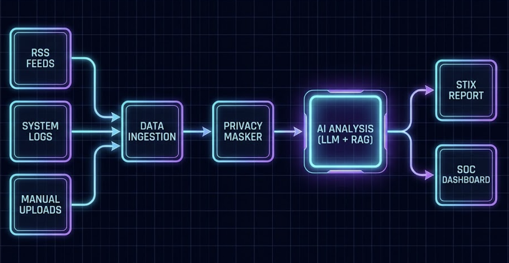
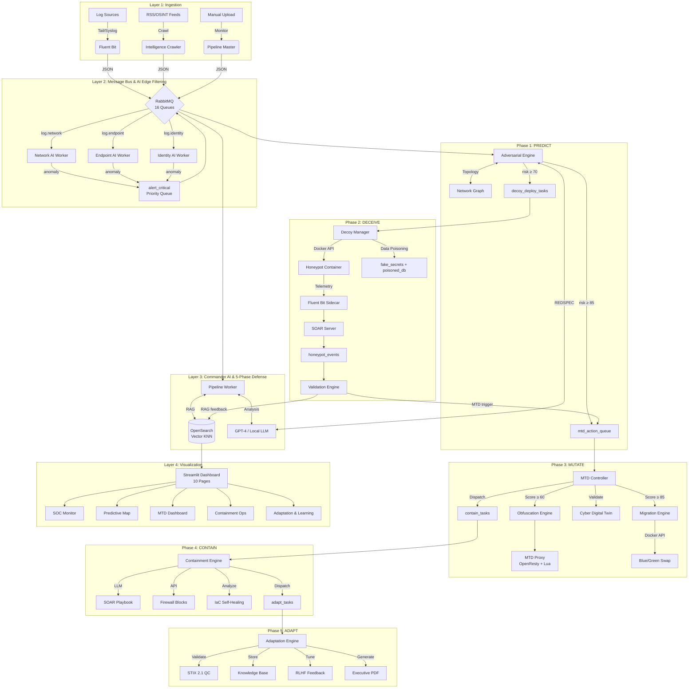

<div align="center">

# 🛡️ NeoVigil
## The Active Adversarial Architecture for Autonomous Cyber Defense

</div>

[]()
[]()
[]()
[]()
[]()
[]()


NeoVigil is a next-generation, AI-powered Security Operations Center that transcends passive detection. It implements a **5-Phase Active Defense Lifecycle** — predicting attack paths before they materialize, deploying self-evolving deception to capture attacker tradecraft, dynamically mutating the live attack surface, autonomously containing threats with SOAR playbooks and firewall blocks, and continuously adapting its own AI brain through reinforcement learning feedback.

🔗 [Live Architecture Demo](https://uuluul.github.io/AI-autonomous-SOC/)

---

## 📋 Table of Contents

- [Executive Summary](#-executive-summary)
- [The 5-Phase Defense Lifecycle](#-the-5-phase-defense-lifecycle)
  - [Phase 1 — Predict](#-phase-1--predict-topology-aware-attack-path-prediction)
  - [Phase 2 — Deceive](#-phase-2--deceive-self-evolving-dynamic-honeypots)
  - [Phase 3 — Mutate](#-phase-3--mutate-moving-target-defense)
  - [Phase 4 — Contain](#-phase-4--contain-automated-containment--isolation)
  - [Phase 5 — Adapt](#-phase-5--adapt-brain-self-evolution)
- [System Architecture](#-system-architecture)
- [Core Platform Capabilities](#-core-platform-capabilities)
- [Quick Start](#-quick-start)
- [Usage & Operations](#-usage--operations)
- [The APT Kill Chain Demo](#-the-apt-kill-chain-demo)
- [Configuration Reference](#-configuration-reference)
- [Tech Stack](#-tech-stack)
- [Testing & CI/CD](#-testing--cicd)
- [License & Acknowledgments](#-license--acknowledgments)

---

## 🎯 Executive Summary

Traditional SOC platforms are **fundamentally reactive**. They wait for an attacker to breach the perimeter, then scramble to detect, triage, and contain. By the time an analyst reviews the alert, the adversary has already pivoted, exfiltrated, and covered their tracks.

**NeoVigil inverts this paradigm.**

Instead of waiting for the breach, NeoVigil builds an **Active Adversarial Architecture** that forces the attacker into a losing position at every stage of the kill chain:

| Traditional SOC | NeoVigil Active Defense |
|:---|:---|
| Detects attacks **after** they happen | **Predicts** the next 3 steps before they occur |
| Static, predictable infrastructure | **Mutates** the attack surface in real-time |
| Relies on known signatures | **Captures** novel zero-day tradecraft from live attackers |
| Manual triage, alert fatigue | **Autonomous** response with RBAC guardrails |
| Intelligence is external, stale | **Self-evolving** — every capture makes the system smarter |

The result is a **closed-loop defense system** where:
1. **Phase 1 (PREDICT)** predicts the attacker's next move,
2. **Phase 2 (DECEIVE)** places a trap exactly where the attacker is going and poisons their AI tools,
3. **Phase 3 (MUTATE)** mutates the real infrastructure so the attacker's reconnaissance becomes worthless,
4. **Phase 4 (CONTAIN)** autonomously blocks attacker IPs, generates SOAR playbooks, and self-heals vulnerable infrastructure,
5. **Phase 5 (ADAPT)** stores attacker TTPs into the knowledge base and tunes AI weights via RLHF — **every incident makes the system permanently smarter**.


---

## 🔺 The 5-Phase Defense Lifecycle

<div align="center">
  
  <br>
  <em>NeoVigil's Active Adversarial Architecture: Predict → Deceive → Mutate → Contain → Adapt</em>
</div>

---

### ⚡ Phase 1 — PREDICT: Topology-Aware Attack Path Prediction


Phase 1 transforms NeoVigil from a detection engine into a **prediction engine**. Using a Red Team LLM persona called **REDSPEC** (Red-team Speculative Prediction Engine for Cyber-attacks), the system analyzes every high-severity alert and predicts the attacker's next 3 kill chain steps.

#### How It Works

```
High-Severity Alert → RAG Context Retrieval → Network Topology Graph
        ↓                     ↓                        ↓
    REDSPEC LLM ← combines all three signals → Predicted Kill Chain
        ↓
   3-Step Attack Path with per-step confidence scores
        ↓
   Risk ≥ 70 → Deploy Honeypot (Phase 2)
   Risk ≥ 85 → Trigger MTD (Phase 3)
```

#### Key Capabilities

| Capability | Detail |
|:---|:---|
| **REDSPEC Persona** | GPT-4 as a Red Team operator predicting lateral movement, privilege escalation, and data exfiltration paths |
| **Topology-Aware** | Ingests network graph (subnets, ACLs, trust zones) so predictions follow real network paths |
| **CMDB-Enriched** | Correlates asset criticality (Critical/High/Medium/Low) to prioritize predictions |
| **RAG-Augmented** | Retrieves historical attack patterns from the vector knowledge base for grounded predictions |
| **Multi-Tenant** | Predictions are partitioned by `tenant_id` for full data isolation |
| **Zero-Log Prediction** | Novel capability: predicts attack paths even when no prior alerts exist for a new tenant |

#### Output: Predictive Threat Map

The Streamlit dashboard renders predictions as an interactive **🎯 Predictive Threat Map** showing:
- Source host (compromised)
- Predicted kill chain arrows with per-step confidence
- Destination hosts with criticality halos
- Risk score heat coloring

---

### 🍯 Phase 2 — DECEIVE: Self-Evolving Dynamic Honeypots


Phase 2 closes the loop. When Phase 1 predicts an attack path, Phase 2 automatically deploys a **honeypot on the predicted path** — a realistic decoy service that looks just like the real target but is an instrumented trap.

#### How It Works

```
Phase 1 Prediction (risk ≥ 70)
        ↓
   Decoy Manager → Selects template matching predicted service
        ↓
   Docker API → Deploys honeypot container on isolated network
        ↓
   Fluent Bit Sidecar → Streams all interaction telemetry
        ↓
   Validation Engine → Compares actual attacker behavior vs. prediction
        ↓
   RAG Feedback → Captured techniques indexed to knowledge base
        ↓
   Phase 1 retrieves captures for future predictions → SYSTEM GETS SMARTER
```

#### Key Capabilities

| Capability | Detail |
|:---|:---|
| **8 Service Templates** | SSH, SMB, RDP, HTTP, HTTPS, PostgreSQL, MySQL, LDAP — each with realistic banners and behaviors |
| **3 Fidelity Tiers** | LOW (banner-only), MEDIUM (partial protocol), HIGH (full service emulation) |
| **Tombstone TTL** | Honeypots auto-destroy after configurable TTL (default: 4h) to prevent sprawl |
| **Prediction Validation** | Compares predicted techniques against actual attacker TTPs — measures Phase 1 accuracy |
| **Zero-Day Detection** | Novel payloads (hash never seen before) are flagged for Tier 2+ analyst review |
| **RAG Feedback Loop** | Every capture is indexed back into `security-logs-knn`, making REDSPEC smarter |

#### The Self-Evolution Loop

```
Phase 1 predicts attack → Honeypot deployed on path
     ↑                           ↓
System gets smarter     Attacker hits honeypot
     ↑                           ↓
RAG indexes capture ← Validation Engine processes telemetry
```

This is not a static system. **Every attacker that touches NeoVigil makes it harder for the next one.**

---

### 🔄 Phase 3 — MUTATE: Moving Target Defense


Phase 3 is the final piece of the triad. When the MTD composite threat score reaches critical thresholds, NeoVigil **dynamically alters the live production infrastructure** — spoofing server fingerprints and performing zero-downtime container migrations — so that all attacker reconnaissance becomes instantly invalid.

#### How It Works

```
Trigger Sources:
  • Phase 1: prediction risk ≥ 85
  • Phase 2: validated honeypot capture
  • Scanner detection: repeated probes from same IP
  • Manual: analyst-initiated

        ↓ mtd_action_queue

   MTD Controller → Gathers multi-signal intelligence
        ↓
   Composite Score = 40% prediction risk
                   + 30% honeypot captures
                   + 20% scanner frequency
                   + 10% asset criticality
        ↓
   Score ≥ 60 → Obfuscation (auto-approved)
   Score ≥ 75 → Migration proposed (Tier2 approval)
   Score ≥ 85 → Migration executed (Tier2 approval)
```

#### Key Capabilities

| Capability | Detail |
|:---|:---|
| **Nginx/OpenResty Obfuscation** | Lua-powered per-IP header spoofing — scanners see Apache when you run Nginx, IIS when you run Node.js |
| **6 Spoof Profiles** | Apache/PHP, IIS/ASP.NET, LiteSpeed, CloudFlare, Caddy, Custom — randomly selected per scanner |
| **Blue/Green Migration** | 4-phase zero-downtime container migration: Clone → Start Green → Drain → Swap |
| **Rollback Snapshots** | Every migration is reversible within configurable TTL (default: 4h) |
| **Post-Migration Honeypot** | After migration, the old container is automatically converted into a honeypot |
| **RBAC Approval Gates** | Obfuscation: auto-approved. Migration: Tier2+ required. Emergency lockdown: Admin required |
| **Approval Timeout Escalation** | Unapproved actions escalate after 15min (configurable) |
| **Immutable Audit Trail** | Every action — propose, approve, reject, execute, rollback — logged to `mtd-audit-log` |

---

### 🚨 Phase 4 — CONTAIN: Automated Containment & Isolation


Phase 4 takes decisive action. When Phase 3 completes its MTD mutation, the Containment Engine autonomously generates SOAR playbooks, executes hardware-level firewall blocks, and self-heals vulnerable infrastructure — all while maintaining a forensic-grade audit trail.

#### How It Works

```
Phase 3 MTD Action Completed
        ↓ contain_tasks queue

   Containment Engine → Three parallel sub-engines:
        ↓                    ↓                    ↓
   Playbook Generator   Firewall Client      IaC Analyzer
   (LLM + STIX 2.1)    (API / Mock mode)    (Nginx / Terraform)
        ↓                    ↓                    ↓
   contain-playbooks    contain-actions       iac-patches
        ↓
   Audit Logger → immutable timestamped evidence
        ↓
   Dispatch to adapt_tasks queue → Phase 5
```

#### Key Capabilities

| Capability | Detail |
|:---|:---|
| **LLM Playbook Generation** | Commander AI writes SOAR playbooks with STIX 2.1 bundles; falls back to rule-based templates if LLM unavailable |
| **Hardware-Level Firewall Blocks** | Dual-mode `FirewallClient` — mock mode for staging, live API mode for production. Blocks attacker IPs within seconds |
| **IaC Self-Healing** | AI analyzes Nginx configs and network topology for vulnerabilities, auto-generates patches |
| **Immutable Audit Trail** | Every containment action (block, patch, playbook) logged with timestamped signatures for forensic and compliance evidence |
| **Cap-20 Safety Limit** | Maximum 20 simultaneous firewall blocks per incident to prevent accidental lockout |
| **Cross-Phase Dispatch** | Automatically forwards full incident context (kill chain, IPs, playbook, patches) to Phase 5 for adaptation |

---

### 🧠 Phase 5 — ADAPT: Brain Self-Evolution


Phase 5 closes the loop. Every incident — successful defense or partial failure — feeds back into the AI's knowledge base and tunes its prediction weights. The system doesn't just defend; it **evolves**.

#### How It Works

```
Phase 4 Containment Complete
        ↓ adapt_tasks queue

   Adaptation Engine → Five sequential sub-engines:
        ↓
   1. STIX Quality Control → validate_stix.py (STIX 2.1 compliance)
        ↓
   2. Knowledge Base Population → store TTPs in cti-knowledge-base (KNN vectors)
        ↓
   3. RLHF Feedback Loop → compare predictions vs. actual → adjust thresholds
        ↓
   4. Incident Timeline → query all 5 phase indices → build correlated timeline
        ↓
   5. Executive Report → to_pdf.py → PDF with full Phase 1–4 lifecycle → Dashboard
```

#### Key Capabilities

| Capability | Detail |
|:---|:---|
| **STIX 2.1 Quality Gate** | Validates all generated threat intelligence against the OASIS standard before storage |
| **KNN Knowledge Base** | Stores attacker TTPs as searchable vectors in OpenSearch — future predictions draw on real incident data |
| **RLHF Feedback Loop** | Compares Phase 1 predictions against actual attacker behavior; recommends threshold adjustments to reduce false positives |
| **Incident Timeline** | Queries all 5 phase indices to build a correlated timeline — one document showing the full lifecycle of an attack |
| **Executive PDF Reports** | Auto-generated PDF with incident summary, containment actions taken, KB entries added, and RL recommendations |
| **Prediction Accuracy Tracking** | Computes and stores prediction accuracy metrics per incident for continuous improvement |

#### The Self-Evolution Loop

```
Phase 1 predicts attack → Honeypot deployed → Infrastructure mutated
     ↑                                                    ↓
System gets smarter                           Threat contained & patched
     ↑                                                    ↓
RLHF tunes weights ← KB stores TTPs ← Incident timeline built ← PDF generated
```

**Every attacker that touches NeoVigil makes the next defense cycle faster, more accurate, and harder to evade.**

---

## 🏗️ System Architecture

NeoVigil is composed of **22 microservices** orchestrated via Docker Compose:


```mermaid
graph TB
    subgraph "Layer 1: Ingestion"
        LOG[Log Sources] -->|Tail/Syslog| FB(Fluent Bit)
        RSS[RSS/OSINT Feeds] -->|Crawl| IC(Intelligence Crawler)
        MAN[Manual Upload] -->|Monitor| MASTER(Pipeline Master)
    end

    subgraph "Layer 2: Message Bus & AI Edge Filtering"
        FB & IC & MASTER -->|JSON| RMQ{RabbitMQ<br>16 Queues}
        RMQ -->|log.network| AWN[Network AI Worker]
        RMQ -->|log.endpoint| AWE[Endpoint AI Worker]
        RMQ -->|log.identity| AWI[Identity AI Worker]
        AWN & AWE & AWI -->|anomaly| ACQ[alert_critical<br>Priority Queue]
        ACQ --> RMQ
    end

    subgraph "Layer 3: Commander AI & 5-Phase Defense"
        RMQ --> WORKER[Pipeline Worker]
        WORKER <-->|RAG| OSEARCH[(OpenSearch<br>Vector KNN)]
        WORKER <-->|Analysis| LLM[GPT-4 / Local LLM]
    end

    subgraph "Phase 1: PREDICT"
        RMQ --> AE[Adversarial Engine]
        AE <-->|REDSPEC| LLM
        AE <-->|Topology| TOPO[Network Graph]
        AE -->|risk ≥ 70| DDQ[decoy_deploy_tasks]
        AE -->|risk ≥ 85| MTQ[mtd_action_queue]
    end

    subgraph "Phase 2: DECEIVE"
        DDQ --> DM[Decoy Manager]
        DM -->|Docker API| HONEY[Honeypot Container]
        DM -->|Data Poisoning| POISON[fake_secrets + poisoned_db]
        HONEY -->|Telemetry| FBSIDE[Fluent Bit Sidecar]
        FBSIDE --> SOAR[SOAR Server]
        SOAR --> HPQ[honeypot_events]
        HPQ --> VE[Validation Engine]
        VE -->|RAG feedback| OSEARCH
        VE -->|MTD trigger| MTQ
    end

    subgraph "Phase 3: MUTATE"
        MTQ --> MTDC[MTD Controller]
        MTDC -->|Score ≥ 60| OBFENG[Obfuscation Engine]
        OBFENG --> PROXY[MTD Proxy<br>OpenResty + Lua]
        MTDC -->|Score ≥ 85| MIGENG[Migration Engine]
        MTDC -->|Validate| TWIN[Cyber Digital Twin]
        MIGENG -->|Docker API| BLUEGREEN[Blue/Green Swap]
        MTDC -->|Dispatch| CTQ[contain_tasks]
    end

    subgraph "Phase 4: CONTAIN"
        CTQ --> CE[Containment Engine]
        CE -->|LLM| PLAYBOOK[SOAR Playbook]
        CE -->|API| FW[Firewall Blocks]
        CE -->|Analyze| IAC[IaC Self-Healing]
        CE -->|Dispatch| ATQ[adapt_tasks]
    end

    subgraph "Phase 5: ADAPT"
        ATQ --> ADAPT[Adaptation Engine]
        ADAPT -->|Validate| STIX[STIX 2.1 QC]
        ADAPT -->|Store| KB[Knowledge Base]
        ADAPT -->|Tune| RLHF[RLHF Feedback]
        ADAPT -->|Generate| PDF[Executive PDF]
    end

    subgraph "Layer 4: Visualization"
        OSEARCH --> UI[Streamlit Dashboard<br>10 Pages]
        UI --> SOC[SOC Monitor]
        UI --> PTMAP[Predictive Map]
        UI --> MTDDASH[MTD Dashboard]
        UI --> CONTAIN_UI[Containment Ops]
        UI --> ADAPT_UI[Adaptation & Learning]
    end
```

### Service Inventory

| # | Service | Purpose | Phase |
|:-:|:---|:---|:-:|
| 1 | `opensearch-node` | Vector search, KNN, telemetry indexing | Core |
| 2 | `opensearch-dashboards` | Data exploration & visualization | Core |
| 3 | `rabbitmq` | Message bus (9 queues) | Core |
| 4 | `fluent-bit` | Real-time log streaming | Core |
| 5 | `soar-server` | Alert relay & honeypot telemetry bridge | Core |
| 6 | `log-generator` | Simulated log source | Core |
| 7 | `setup-worker` | Index initialization | Core |
| 8 | `cti-pipeline-master` | File ingestion & scheduling | Core |
| 9 | `cti-pipeline-worker` | AI analysis (RAG + LLM) | Core |
| 10 | `threat-hunter` | Continuous IOC scanning | Core |
| 11 | `intelligence-crawler` | OSINT feed aggregation | Core |
| 12 | `cti-ui` | Streamlit SOC dashboard | Core |
| 13 | `prediction-engine` | REDSPEC attack path prediction | Phase 1 |
| 14 | `decoy-manager` | Honeypot lifecycle orchestration | Phase 2 |
| 15 | `validation-engine` | Prediction validation & RAG feedback | Phase 2 |
| 16 | `mtd-controller` | MTD scoring, RBAC, action dispatch | Phase 3 |
| 17 | `mtd-proxy` | OpenResty with Lua obfuscation | Phase 3 |
| 18 | `ai-worker-network` | Network log edge filtering (port scans, C2) | Layer 2 |
| 19 | `ai-worker-endpoint` | Endpoint log edge filtering (LOLBins, mimikatz) | Layer 2 |
| 20 | `ai-worker-identity` | Identity log edge filtering (brute force, kerberoasting) | Layer 2 |
| 21 | `contain-engine` | Automated containment, SOAR playbooks, firewall blocks | Phase 4 |
| 22 | `adapt-engine` | Brain self-evolution, KB population, RLHF, PDF reports | Phase 5 |

---

## 🛠️ Core Platform Capabilities

Beyond the 5-Phase Defense Lifecycle, NeoVigil provides a full enterprise SOC platform:

- **AI Worker Edge Filtering** — Three domain-specific workers (Network, Endpoint, Identity) perform sub-second KNN-based noise filtering, only escalating true anomalies to Commander AI
- **Data Poisoning** — Generates syntactically valid fake secrets, poisoned databases with canary tokens, and contradictory data designed to induce hallucinations in attacker AIs (WormGPT)
- **Cyber Digital Twin** — Pre-validates every MTD mutation in a simulated parallel environment, guaranteeing zero business disruption before execution
- **Automated Containment** — LLM-generated SOAR playbooks, hardware-level firewall API blocking, and IaC self-healing patches — all with forensic-grade audit trails
- **Self-Evolving Knowledge Base** — Every incident feeds attacker TTPs into the KNN vector store; RLHF feedback tunes prediction thresholds, making the system permanently smarter
- **Dual-Layer RAG** — Queries both the MITRE/AIDEFEND expert knowledge base and internal historical CTI reports for grounded AI analysis
- **STIX 2.1 Compliance** — Generates and validates industry-standard threat intelligence bundles with automated quality gates
- **Executive PDF Reports** — Automated report generation with full Phase 1–4 incident timeline, IOCs, TTPs, and AI-suggested mitigations
- **PII Masking** — Automatic redaction of IPs/emails before LLM processing
- **GeoIP Enrichment** — Real-time attacker geolocation for threat mapping
- **CMDB Integration** — Asset criticality scoring for dynamic alert prioritization
- **5-Level RBAC** — Viewer → Tier 1 → Tier 2 → Admin → System Owner (ISO 27001 / SOC 2 ready)
- **SOAR Guardrails** — Critical asset protection, human-in-the-loop for internal threats
- **Immutable Audit Trail** — All analyst actions logged to tamper-proof indices across all 5 phases
- **Dead-Letter Queue** — Zero data loss; failed tasks preserved for forensic review with DLQ monitoring
- **Multi-Tenancy** — Full data isolation via `tenant_id` partitioning across all indices
- **Privacy Shield** — Local LLM enforcement mode blocks cloud API fallback

---

## 🚀 Quick Start

### Prerequisites

| Component | Minimum | Recommended |
|:---|:---|:---|
| **OS** | Linux / macOS / Windows | Linux (Ubuntu 22.04+) |
| **RAM** | 16 GB | 32 GB |
| **CPU** | 4 Cores | 8 Cores |
| **Disk** | 20 GB free | 50 GB free |
| **Docker Engine** | v24.0+ | Latest |
| **Docker Compose** | v2.20+ | Latest |
| **Python** | 3.9+ | 3.10+ |

### 1. Clone & Configure

```bash
git clone https://github.com/uuluul/AI-powered-autonomous-SOC.git
cd AI-powered-autonomous-SOC

cp .env.example .env
```

Edit `.env` with your LLM provider credentials:

```bash
# Option A: Standard OpenAI
OPENAI_API_KEY=sk-proj-xxxxxxxxxxxxxxxxxxxxxxx
OPENAI_MODEL=gpt-4o

# Option B: Azure OpenAI
AZURE_OPENAI_API_KEY=your_azure_key
AZURE_OPENAI_ENDPOINT=https://your-resource.openai.azure.com/
AZURE_OPENAI_CHAT_DEPLOYMENT=gpt-4o
AZURE_OPENAI_EMBEDDING_DEPLOYMENT=text-embedding-3-small
AZURE_OPENAI_API_VERSION=2024-02-15-preview
```

### 2. Launch NeoVigil

```bash
docker compose up -d --build
```

This starts all 22 services. On machines with < 16 GB RAM:

```bash
docker compose up -d --build --scale cti-pipeline-worker=1
```

### 3. Initialize Knowledge Base (First Run Only)

```bash
docker compose exec cti-pipeline-master python /app/src/setup_knowledge_base.py
```

Wait for: `✅ MITRE Import Completed` / `✅ AIDEFEND Import Completed`

### 4. Verify Installation

Run the production validation suite to ensure all systems are operational:

```bash
./test_all.sh
```

### 5. Access the Dashboard

Open **[http://localhost:8501](http://localhost:8501)** and log in with `admin / admin`.

---

## 📖 Usage & Operations

### SOC Dashboard Pages

| Page | Description |
|:---|:---|
| 🚨 **Internal Threat Monitor** | Real-time SOC alerts with severity filtering |
| 📈 **Enriched Alerts Dashboard** | Threat map, geolocation, remediation playbooks |
| 🕸️ **Threat Graph** | Visual network topology with attack overlays |
| 📚 **Knowledge Base** | Historical CTI reports, PDF downloads |
| 🔍 **CTI Report Review** | AI analysis approval/rejection workflow |
| 📜 **Audit & Compliance** | Immutable action log (ISO 27001 / SOC 2) |
| 🎯 **Predictive Threat Map** | Phase 1 attack path predictions |
| 🛡️ **Moving Target Defense** | Phase 3 obfuscation rules, approvals, migrations, digital twin validation |
| 🚨 **Containment Operations** | Phase 4 firewall blocks, SOAR playbooks, IaC self-healing patches |
| 🧠 **Adaptation & Learning** | Phase 5 knowledge base growth, RLHF metrics, incident timelines, PDF reports |

### Operational Workflows

**Automated Collection** — Intelligence crawlers continuously fetch from BleepingComputer, TheHackerNews, and OTX AlienVault.

**Threat Hunting** — The hunter module runs 24/7, scanning internal logs against approved IOCs. Matches generate automatic alerts.

**Predictive Defense** — High-severity alerts trigger REDSPEC predictions. Risk ≥ 70 deploys decoys. Risk ≥ 85 triggers MTD evaluation.

**MTD Approval** — Migration proposals appear in the 🛡️ MTD dashboard. Tier 2+ analysts approve or reject within the configurable timeout window (default: 15 min).

---

## 🎬 The APT Kill Chain Demo

NeoVigil ships with `simulate_apt_killchain.py` — a cinematic, color-coded terminal script that demonstrates the full Active Defense Triad in real-time.

```bash
# Ensure NeoVigil is running, then:
python simulate_apt_killchain.py
```

The script simulates a full APT kill chain across all 5 phases:

1. **Phase 1 (Predict)** — Injects a Log4Shell initial access event → forces REDSPEC to predict the kill chain
2. **Phase 2 (Deceive)** — Simulates the attacker hitting the predicted honeypot → triggers validation & RAG feedback
3. **Phase 3 (Mutate)** — Floods scanner probes → pushes MTD score ≥ 85 → triggers obfuscation + migration proposal
4. **Phase 4 (Contain)** — Generates SOAR playbook → blocks attacker IPs via firewall API → dispatches to adaptation
5. **Phase 5 (Adapt)** — Validates STIX quality → populates knowledge base → builds incident timeline → generates executive PDF

---

## ⚙️ Configuration Reference

| Variable | Default | Description |
|:---|:---|:---|
| `RETENTION_DAYS` | `30` | Days to keep processed files |
| `CONFIDENCE_THRESHOLD` | `80` | Minimum score for PDF/blocking alert |
| `RAG_TOP_K` | `3` | Similar past cases to retrieve |
| `MAX_ACTIVE_DECOYS` | `10` | Maximum concurrent honeypots |
| `DECOY_TTL_HOURS` | `4` | Honeypot auto-destroy timer |
| `MTD_APPROVAL_TIMEOUT` | `15` | Minutes before unapproved actions escalate |
| `MTD_DRAIN_TIMEOUT` | `30` | Seconds to drain connections during migration |
| `MTD_ROLLBACK_HOURS` | `4` | Hours a migration remains rollback-eligible |

---

## 🛠️ Tech Stack

| Layer | Technology |
|:---|:---|
| **Language** | Python 3.10+ |
| **AI/LLM** | GPT-4o, LangChain (RAG), REDSPEC (adversarial persona) |
| **Search & Vector DB** | OpenSearch (KNN, Vector Search, Lucene) |
| **Message Bus** | RabbitMQ (16 queues, priority queue, durable, DLQ) |
| **Log Ingestion** | Fluent Bit (streaming), RSS/OTX crawlers (batch) |
| **Edge AI** | AI Worker (KNN anomaly scoring, pattern matching, per-domain classification) |
| **Deception** | Docker SDK (container orchestration), Fluent Bit sidecars, Data Poisoning Engine |
| **MTD Proxy** | OpenResty (Nginx + Lua), Cyber Digital Twin validation |
| **Containment** | SOAR playbook generator, Firewall API client, IaC patch generator |
| **Adaptation** | RLHF feedback loop, KNN knowledge base writer, incident timeline builder |
| **Container Orchestration** | Docker & Docker Compose (22 services) |
| **Frontend** | Streamlit (10 pages), PyDeck (3D maps), Plotly, Mermaid.js |
| **Data Standards** | STIX 2.1, MITRE ATT&CK, AIDEFEND |
| **Testing** | Pytest (128 unit tests), Integration Suite, E2E 5-Phase Flow, CI/CD |

---

## 🧪 Testing & CI/CD

```bash
# Run the full Production Validation Suite (Recommended)
./test_all.sh

# Run unit tests for Phase 4/5 modules (128 tests, no Docker required)
python3 -m pytest tests/unit/test_phase4_phase5.py -v

# Run specific test layers
python3 tests/integration/test_components.py  # Integration (RabbitMQ -> Worker -> OpenSearch)
python3 tests/system/verify_brain_growth.py    # System (AI Learning & Indexing)
python3 tests/load/api_stress_test.py          # Load (API Concurrency)
```

### Staging Environment (No API Costs)

```bash
docker compose -f docker-compose.staging.yml up -d --build
```

Uses a **Mock LLM** on port 8000 to simulate GPT-4 responses locally.

---

## 📜 License & Acknowledgments

This project is licensed under the **MIT License**.

### Framework Attributions

- **[MITRE ATT&CK®](https://attack.mitre.org/)** — Adversary tactics & technique mapping
- **[STIX™ 2.1](https://oasis-open.github.io/cti-documentation/)** — OASIS Open Standard for threat intelligence
- **[AIDEFEND](https://github.com/edward-playground/aidefense-framework)** — AI Defense Framework by Edward Lee (CC BY 4.0)
- **[OASIS stix2-validator](https://github.com/oasis-open/cti-stix-validator)** — STIX 2.1 compliance validation

---

## 🚀 Future Roadmap & Enterprise Scalability

While the current architecture is robust and fully functional for staging and demonstration purposes, the following enhancements are planned for the production environment to handle petabyte-scale telemetry and ensure high availability:

### 1. Data Lifecycle Management & Storage Tiering (OpenSearch ISM)
To optimize storage costs and query performance for massive security logs, we will implement **Hot-Warm-Cold Architecture** via Index State Management (ISM):
* **Hot Tier (NVMe SSDs):** For real-time ingestion, active AI enrichment, and high-frequency querying (Retention: 1-30 days).
* **Warm/Cold Tier (High-Capacity HDDs):** For long-term compliance storage, historical auditing, and threat hunting (Retention: 30-180+ days). 
* *Note: The initial ISM policy blueprint is already defined in `config/opensearch_ism_policy.json`.*

### 2. High Availability (HA) & Clustering
Transitioning from a single-node deployment to a fully distributed cluster:
* **OpenSearch Cluster:** Deploying dedicated Master, Ingest, and Data nodes across multiple availability zones.
* **RabbitMQ Mirrored Queues:** Upgrading the `cti_exchange` and queues to a clustered setup to ensure zero message loss during node failures.

### 3. Distributed AI Worker Scaling (KEDA)
Event-driven auto-scaling for the AI Worker edge filtering layer using **KEDA** (Kubernetes Event-Driven Autoscaler). Each domain worker (Network, Endpoint, Identity) scales independently based on its RabbitMQ queue depth, ensuring zero latency during DDoS floods while scaling down during idle periods to minimize cloud costs.

### 4. Container Orchestration & Auto-Scaling (Kubernetes)
Migrating from Docker Compose to a fully managed **Kubernetes (K8s)** cluster (e.g., AWS EKS, GCP GKE) for production-grade orchestration and resilience:
* **Event-Driven Auto-Scaling (KEDA):** Dynamically scaling the Python AI Worker pods based on the RabbitMQ `cti_queue` depth. This ensures zero latency during DDoS attacks or sudden surges in telemetry, while scaling down during idle times to save cloud costs.
* **Stateful Resilience:** Deploying OpenSearch and RabbitMQ via K8s StatefulSets with Persistent Volume Claims (PVCs) mapped directly to our defined Hot/Warm storage tiers.
* **Self-Healing & Zero-Downtime:** Leveraging K8s liveness and readiness probes to guarantee maximum uptime for the ingestion and threat detection pipeline.